# EV-Sim: A Simulation Framework for Ride-Hailing with Electric Vehicles


## Introduction
The transportation industry is rapidly shifting from internal combustion engine vehicles to electric vehicles (EVs), driven by technological advancements, growing climate awareness, and strong government support.
This transition is particularly evident in the ride-hailing sector, where companies are increasingly adopting EV fleets and planning full transitions.
To ensure these EV-based systems provide high-quality service, it is crucial to understand vehicle design, necessary infrastructure, and develop efficient algorithms for matching and charging.
Our framework simulates a fleet of autonomous EVs within an urban transportation network using a spatial queueing mechanism.

The simulation involves a certain amount of EVs and charging stations placed throughout the city.
As a general-purpose and adaptable simulation architecture that closely mimics real-world dynamics, this open-source platform considers and integrates a series of critical questions, including charging station locations, car initial locations, fleet parameters, charger parameters, matching algorithms, and charging algorithms.
By providing decision-makers with a tool for modeling and analyzing the performance of EV fleets, this simulator empowers the planners to experiment with different scenarios and enhance the efficiency of EV fleet operations.


## Table of Contents
- [Simulation Overview](#simulation-overview)
- [System Dynamics and Simulation Workflow](#system-dynamics-and-simulation-workflow)
- [Main Classes Descriptions](#main-classes-descriptions)
- [Core Algorithms](#core-algorithms)
- [Get Started](#get-started)
- [Outputs](#outputs)
- [Example Simulations](#example-simulations)
- [Contact](#contact)


## Simulation Overview
The customer demand for rides can be modeled based on different datasets, such as NYC taxi data and Chicago data.
Once receiving a ride request from a customer, the matching algorithm in the system evaluates and decides which EV to dispatch and serve the customer.
If no EV is appropriate to meet the trip, the customer's request cannot be fulfilled and is dropped.
Once an EV is dispatched, it travels to pick up the customer and then proceed to the customer's destination.
Throughout their operations to serve trips, the EVs lose their State of Charge (SoC), requiring frequent charging.
In turn, the charging algorithm determines the most effective timing and location for each EV to recharge in order to sustain operations.
This initiative is motivated by the advent of electric vehicle fleets deployed as taxis.

The simulation framework incorporates various real-life features and is based on a process-based discrete-event simulation framework using SimPy, where each discrete event activates some specific processes. 
Each customer arrival triggers a series of events: an EV picks up the customer, and other EVs may be directed to charging stations.
These events then further trigger more events in the simulation. For example, once the pickup process is completed, it then triggers the process of driving with customer to their destination, followed by additional related processes.


## System Dynamics and Simulation Workflow
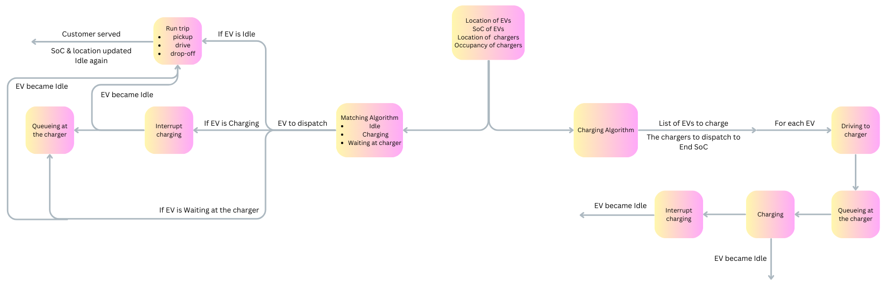
The above diagram illustrates the simulation's core logic, with the time axis tracking customer arrivals, which follow either a Poisson process or a predefined dataset.
Each arrival triggers the matching and charging algorithms.
The matching algorithm assigns a vehicle to the customer.
If the vehicle is busy (e.g., en route to or charging), its current activity is interrupted, its state updated to idle, and it picks up the passenger.
After dropping off the passenger, the vehicle’s state and SoC are refreshed.
Simultaneously, the charging algorithm sends EVs to chargers.
Vehicles queue, charge, and if called to serve a customer during charging, their current activity is interrupted.
After charging, the vehicle's state and SoC are updated.


## Main Classes Descriptions

### The Parameter Classes
The ```sim_metadata.py``` file defines the parameter classes and enumerations used to configure the simulation environment.
They serve to structure the simulation’s parameters, states, and behaviors, providing a clear and organized way
to represent various elements and settings of the electric vehicle (EV) fleet simulation:

Here’s a breakdown of each component and its purpose within the simulation framework.

- ```SimMetaData``` class: Contains global simulation settings, including:
  - ```avg_vel_mph```: Average vehicle speed in miles per hour.
  - ````consumption_kwhpmi````: Energy consumption in kWh per mile.
  - ```pack_size_kwh```: Battery pack size in kWh.
  - ```charge_rate_kw```: Charging rate in kW.
  - ```min_allowed_soc```: Minimum allowed SoC.
  - ```quiet_sim```: Controls verbosity of the simulation output.
  - ```results_folder```: Directory for saving simulation results.
  - ```random_seed``` & ```random_seed_gen```: Parameters for controlling randomness.
  - ```save_results```: Toggles whether simulation results are saved and plotted.
  - ```freq_of_data_logging_min```: Frequency of data logging in minutes.
  - ```demand_curve_res_min```: Resolution of the demand curve in minutes.
  - ```test```: A flag for test scenarios.
  - ```max_lat``` & ```max_lon```: Maximum latitude and longitude for the simulation area.
- ```MatchingAlgo``` class: Enumerates the algorithms used for matching passengers with vehicles:
  - ```POWER_OF_D```: A matching algorithm that considers the closest d vehicles of the trip demand and chooses the one with the highest SoC.
  - ```CLOSEST_AVAILABLE_DISPATCH```: A matching algorithm that dispatches the closest available vehicle of the trip demand.
  - ```POWER_OF_RADIUS```: A matching algorithm that is similar to ```POWER_OF_D``` but considers a radius.
- ```AvailableCarsForMatching``` class: Defines which cars are considered for trip matching:
  - ```ONLY_IDLE```: Only match idle vehicles.
  - ```IDLE_AND_CHARGING```: Includes both idle and charging vehicles.
  - ```IDLE_CHARGING_DRIVING_TO_CHARGER```: Includes idle, charging, and vehicles driving to a charger.
- ```PickupThresholdType```: Specifies the type of threshold used for vehicle dispatch:
  - ```PERCENT_THRESHOLD```: Based on a percentage threshold.
  - ```CONSTANT_THRESHOLD```: A fixed numerical threshold.
  - ```NO_THRESHOLD```: No threshold is applied.
  - ```BOTH_PERCENT_AND_CONSTANT```: Combines percentage and constant thresholds.
  - ```EITHER_PERCENT_OR_CONSTANT```: Uses either percentage or constant thresholds.
  - ```MIN_AVAILABLE_CARS_PERCENT```: Ensures a minimum percentage of available cars.
- ```PickupThresholdMatchingParams```: Parameters for the pickup threshold matching algorithm:
  - ```threshold_percent```: Percentage threshold for matching.
  - ```threshold_min```: Minimum threshold for the number of vehicles.
  - ```min_available_cars_percent```: Minimum percentage of cars that must remain available.
- ```AdaptivePowerOfDParams```: Parameters for the adaptive ```POWER_OF_D``` algorithm:
  - ```threshold_percent_of_cars_idling```: Threshold percentage of idling cars before adaptation.
  - ```n_trips_before_updating_d```: Number of trips before updating the ```d``` parameter.
  - ```adaptive_d```: Flag indicating whether the ```d``` parameter is adaptive.
- ```ChargingAlgoParams``` class: Parameters related to vehicle charging strategies:
  - ```lower_soc_threshold```: Lower SoC threshold for charging initiation.
  - ```higher_soc_threshold```: Higher SoC threshold for charging completion.
  - ```safety_factor_to_reach_closest_charger```: Safety margin for reaching the nearest charger.
  - ```infinite_chargers```: Indicates if chargers are unlimited.
  - ```start_of_the_night``` & ```end_of_the_night```: Defines the nighttime period for charging strategies.
  - ```n_cars_driving_to_charger_discounter```: Discount factor for the number of cars driving to a charger.
- ```ChargingAlgo``` class: Enumerates charging strategies:
  - ```CHARGE_ALL_IDLE_CARS```: A charging algorithm that charges idle cars all the time.
  - ```CHARGE_ALL_IDLE_CARS_AT_NIGHT```: A charging algorithm that charges idle cars primarily at night.
- ```CarState``` class: Enumerates the possible states of a vehicle:
  - ```DRIVING_WITH_PASSENGER```: Vehicle is transporting a passenger.
  - ```DRIVING_WITHOUT_PASSENGER```: Vehicle is driving to pick up a passenger.
  - ```CHARGING```: Vehicle is charging.
  - ```WAITING_FOR_CHARGER```: Vehicle is waiting for an available charger.
  - ```DRIVING_TO_CHARGER```: Vehicle is en route to a charger.
  - ```IDLE```: Vehicle is idle and available for dispatch.
- ```TripState``` class: Enumerates the states of a trip:
  - ```UNAVAILABLE```: Trip is not available for matching.
  - ```WAITING```: Trip is waiting for a vehicle.
  - ```MATCHED```: Trip has been matched with a vehicle.
  - ```RENEGED```: Trip has been dropped.
- ```ChargerState``` class: Enumerates the states of a charger:
  - ```AVAILABLE```: Charger is available for use.
  - ```BUSY```: Charger is currently in use.
- ```Dataset``` class: Enumerates the datasets that can be used for simulations:
  - ```NYTAXI```: New York Taxi dataset.
  - ```OLD_NYTAXI```: An older version of the New York Taxi dataset.
  - ```RANDOMLYGENERATED```: Randomly generated dataset.
  - ```CHICAGO```: Chicago Taxi dataset.
- ```DatasetParams```: Parameters related to dataset configuration:
  - ```percent_of_trips_filtered```: Percentage of trips to be filtered out.
  - ```percentile_lat_lon```: Latitude and longitude percentile for filtering trips.
  - ```longitude_range_min``` & ```longitude_range_max```: Longitude range for the dataset.
  - ```latitude_range_min``` & ```latitude_range_max```: Latitude range for the dataset.
  - ```delta_latitude``` & ```delta_longitude```: Increments for latitude and longitude.
  - ```uniform_locations```: Flag indicating whether to use uniform locations.
- ```Initialize``` class: Enumerates methods for initializing vehicle positions:
  - ```RANDOM_UNIFORM```: Random uniform initialization.
  - ```RANDOM_PICKUP```: Random initialization based on pickup locations.
  - ```RANDOM_DESTINATION```: Random initialization based on destination locations.
  - ```EQUAL_TO_INPUT```: Initializes to match input data.
- ```DistFunc``` class: Enumerates the distance functions used for calculating trip distances:
  - ```HAVERSINE```: Haversine formula for calculating great-circle distances. 
  - ```MANHATTAN```: Manhattan distance, which sums the absolute differences in latitude and longitude.


### The Main file
The ```main.py``` file is the central script responsible for running the simulations for electric vehicle fleet management.
It includes a single function, ```run_simulation()```, which defines the simulation parameters, initializes the simulation environment, and manages the execution of the simulation.
This function is highly customizable, accepting numerous arguments that allow users to tailor the simulation to specific scenarios and datasets.

#### Simulation Setup:
The function starts by setting up the simulation environment using SimPy, an event-driven simulation library. It loads configuration parameters and paths, setting up the necessary directories for storing results.

#### Data Input Handling:
Depending on the dataset source, the input data is handled differently:
- Real-World Datasets: If the dataset is from a real-world source like NYC Taxi or Chicago datasets, the function loads and filters the data according to the provided time range, trip percentage, and geographical bounds.
```
    data_input = DataInput(percentile_lat_lon=DatasetParams.percentile_lat_lon)
    df_arrival_sequence, dist_correction_factor = data_input.real_life_dataset(
        dataset_source=dataset_source,
        dataset_path=dataset_path,
        start_datetime=start_datetime,
        end_datetime=end_datetime,
        percent_of_trips=DatasetParams.percent_of_trips_filtered,
        dist_func=dist_func
    )
```
- Randomly Generated Datasets: For simulations requiring synthetic data, the function creates a DataFrame with trip information based on defined parameters like simulation duration, arrival rate, and geographical boundaries.
```
    data_input = DataInput()
    df_arrival_sequence, dist_correction_factor = data_input.randomly_generated_dataframe(
        sim_duration_min=sim_duration_min,
        arrival_rate_pmin=arrival_rate_pmin,
        data_dir=home_dir,
        start_datetime=start_datetime
    )
```

#### Simulation Configuration:
The function configures several critical simulation parameters, including charge rate, distance calculation methods, dispatching rules, and batter degradation settings.
These are either passed directly as input arguments or derived from the electric vehicle model selected.
It then initializes key components such as electric vehicle fleet and charging stations.
Each vehicle is assigned specific attributes, and its interactions with the charging stations are managed.

#### Fleet Management:
A ```FleetManager``` object is instantiated to oversee the entire fleet's operations, including trip matching, vehicle dispatching, and charging management.
The ```FleetManager``` coordinates the simulation, ensuring that vehicles are appropriately matched to trips and routed to charging stations when necessary.

#### Simulation Execution:
The simulation environment is run for the specified duration, during which the ```FleetManager``` continuously manages the fleet based on real-time data.
The simulation tracks numerous metrics, including the number of trips, average trip time, and service levels.

#### Post-Simulation Analysis:
After the simulation concludes, the function calculates key performance indicators (KPIs), such as average trip time, service level percentage, average State of Charge, and more.
The simulation creates a comprehensive report of KPIs, saved as a CSV file.
These KPIs provide insights into the efficiency and effectiveness of the fleet management strategies employed.
The function produces several plots to visualize the simulation outcomes, including:
- Histograms for pickup times to understand the distribution of trip requests.
- Stack plots showing the state of the EVs over time, with SoC overlaid to track battery usage.
- Scatter plots representing the spatial distributions of charging stations.
As results, including KPIs, plots, and detailed trip data, are stored in a user-specified directory for easy access and further analysis.


### The Car Class
The ```Car``` class models the behavior and state of an electric vehicle within the simulation.
This class tracks various attributes such as the car's ID, geographic location, state of charge, and current operational state (e.g., idle, charging).
The car’s behavior is driven by discrete events in the simulation, such as driving or charging, with passage of time represented through timeouts.
The class manages EV's transitions between different operational states, simulate the impact of these actions on the car’s SoC, and interact with chargers.

Below are the details of each function.

- Constructor (```__init__```): Initializes a new instance of the ```Car``` class with specific attributes. It sets the initial values for the car's ID, location, SoC, and current state. It can initialize these attributes either randomly or based on specific values provided as arguments.
- ```to_dict()```: Converts the car's attributes (such as ID, location, SoC, and current state) into a dictionary format, making it easier to inspect or export the car's status.
- ```run_trip(trip, dist_correction_factor)```: Simulates the car completing a trip. The function involves several steps: driving to pick up a passenger, picking up the passenger, and completing the trip. The car's SoC is adjusted based on the distance traveled, which may be modified by a distance correction factor to account for variations or errors in the estimated distance.
- ```interrupt_charging(charger_idx, end_soc)```: Interrupts the car’s current charging process. This function handles interruptions during charging. Depending on the car's current activity (e.g., en route to the charger, waiting for a charger, or actively charging), the car's state and SoC are updated accordingly.
- ```drive_to_charger(end_soc, charger_idx, dist_correction_factor)```: Simulates the car driving to a charger. This function updates the car's location, state, and SoC as it drives to the designated charger. The SoC is decremented based on the distance traveled, and the car's state changes from its previous state (e.g., idle or on a trip) to indicate it is now en route to a charger.
- ```car_charging(charger_idx, end_soc)```: Manages the car's charging process. This function simulates the charging process by incrementing the car's SoC over time while the cars is connected to a charger. It also updates the car's state to reflect that it is charging and interacts with the charger to manage occupancy and availability.

### The SuperCharger Class
The ```SuperCharger``` class models the behavior and management of electric vehicle charging stations within a simulation.
It determines the charger’s location, manages the charging posts, and handles the queuing and charging processes for cars.

Below are the details of each function.

- Constructor (```__init__```): Initializes a ```SuperCharger``` instance with key attributes and determines the charger's locations. The function sets up the charger with its ID, number of posts, and simulation environment. It determines the charger's location either randomly or based on trip data, and initializes occupancy and queue attributes.
- ```to_dict()```: Converts the charger's attributes (like ID, location, number of posts, and occupancy) into a dictionary for easy access and inspection during simulation.
- ```queueing_at_charger(car_id, end_soc)```: Manages the queuing and charging process for arriving cars. The function adds the car to the queue and checks if the charger is available. If available, it starts charging the first car in the queue, updates occupancy, and removes the car from the queue. It updates the charger's state to ```BUSY``` if all posts are occupied.


### The Trip Class
The ```Trip``` class models individual trips within an EV fleet simulation.
This class encapsulates the details and behavior of a trip, including its start and end locations, arrival time, trip distance, and state.
It is designed to track the lifecycle of a trip from request to completion or reneging if waiting beyond a specified threshold.

Below are the details of each function.

- Constructor (```__init__```): Initializes a ```Trip``` instance with key attributes. The function sets up the trip's geographic data (start and end locations), the time of arrival, and its initial state.
- ```update_trip_state(renege_time_min)```: Manages the trip's waiting period and potential state change if it waits too long. Specifically, it uses SimPy's timeout to simulate the waiting period. If the trip remains in the WAITING state after the timeout, it changes the state to ```RENEGED```.


### The FleetManager Class
The ```FleetManager``` class manages a fleet of electric vehicles in a simulated environment. It coordinates the dispatch of cars to trips, manages the charging of EVs, and logs data for subsequent analysis.

Below are the details of each function.

- Constructor (```__init__```): Initializes the ```FleetManager``` instance with various parameters essential for operations. These include the environment, car tracker, number of cars, renege time for trips, list of chargers, trip data, matching algorithm, charging algorithm, distance correction factor, and other key variables needed to manage the fleet effectively.
- ```match_trips()```: This function is the core loop of the FleetManager, running continuously to manage the fleet's operations. It updates the dataframes that track the current state of cars and chargers. It implements the logic for dispatching cars to trips and managing their charging based on the configured algorithms. It creates ```Trip``` objects for each trip request, attempts to match them with available cars, and, if matched, simulates the trip execution. It adjusts the matching parameter ```d``` dynamically if adaptive matching is enabled, based on the fleet's performance. It handles a specific charging logic during nighttime, where the charge threshold is adjusted based on the time of day. It logs the state of fleet, such as the SoC of cars, the number of cars in different states, and other relevant metrics periodically.
- ```matching_algorithms(self, trip, df_car_tracker, drive_to_charger_update=True)```: Implements the logic for matching cars to trips. The method calculates the expected pickup time for each car for the current trip and determines the most suitable car to dispatch based on the selected matching algorithm and the specific criteria set by the algorithm.
- ```closest_available_charger(self, car, list_available_chargers)```: Finds the closest available charger to a given car, which is essential when cars need to be sent for charging. The method calculates the distance to each available charger and identifies the nearest one for the car to use.


### The DataInput Class
The ```DataInput``` class is designed for the preparation and analysis of trip data, supporting various functionalities, from generating random trip datasets to processing real-world datasets.
This class includes methods for data visualization and analysis to help understand and calibrate the simulation model.

Below are the details of each function.

- ```randomly_generated_dataframe(sim_duration_min, arrival_rate_pmin, data_dir, start_datetime)```: Generates a DataFrame of simulated trip data. Trips are randomly distributed within defined geographic boundaries, and trip times are estimated based on distances and an average velocity. This function calculates te inter-arrival times of trips based on an exponential distribution, simulating a realistic flow of trip requests. The generated data is saved to a CSV file for incorporating into the simulation.
- ```real_life_dataset(self, dataset_source, dataset_path, start_datetime, end_datetime, percent_of_trips, dist_func, centroid=False)```: Processes real-world trip data, such as the New York Taxi dataset or Chicago dataset. The function filters, samples, and enriches the dataset with additional calculations, including the Haversine distance between trip start and end points. It also performs a linear regression analysis to explore the relationship between the Haversine distance and the recorded trip distance. This analysis helps calibrate the simulation’s average velocity parameter based on the dataset. Throughout this method, various steps include data visualization and statistical analysis to better understand the dataset being processed:
  - Histograms: Generated to visualize the distribution of pickup latitudes and longitudes, providing insights into the geographical spread of trips.
  - Haversine Distances: Calculated for each trip to add a valuable metric for simulation accuracy.
  - Linear Regression Analysis: Performed to understand the relationship between Haversine distances and actual trip distances, including the visualization of the regression line, calculation of the R-squared value, and mean squared error (MSE). This analysis is crucial for fine-tuning the simulation model to better reflect real-world driving conditions.


### The ElectricVehicle Classes:
The ```ev_database.py``` files defines two classes, ```ElectricVehicle``` class and ```ElectricVehicleDatabase``` class.
- ```ElectricVehicle``` class: Models an electric vehicle with attributes such as the battery pack size, energy consumption per mile, and battery degradation percentage.
- ```ElectricVehicleDatabase``` class: Manages a collection of these vehicles, storing them in a dictionary. The database is pre-populated with several vehicle models, each with specific attributes that define their range and efficiency.
  - ```add_vehicle(name, pack_size_kwh, consumption_kwhpmi, battery_degradation_perc):```: Adds new vehicles to the database.
  - ```get_vehicle_info(name)```: Retrieves information about a specific vehicle.


### The Utils Class
The ```Utils``` class provides utility functions for spatial calculations and geographic point sampling.

Below are the details of each function.

- ```calc_dist_between_two_points(start_lat, start_lon, end_lat, end_lon, dist_func, dist_correction_factor=1)```: Calculates the distance between two geographic points or sets of points using either the Haversine or Manhattan method. The function handles cases where the inputs are either single points or arrays of points. For the Haversine method, it calculates the great-circle distance between the points. For the Manhattan method, it computes the sum of the distances along the latitudinal and longitudinal paths. It adjusts the calculated distance by a dist_correction_factor to account for factors like road networks.
- ```sample_unif_points_on_sphere(lon_min, lon_max, lat_min, lat_max, size=None)```: Generates random points uniformly distributed on a spherical surface within specified longitude and latitude bounds. To be specifici, the function converts latitude and longitude bounds to spherical coordinates. It samples points uniformly over the spherical surface within these bounds, then converts back to geographic coordinates.


### The DataLogging Class
The ```DataLogging``` class records and organizes various statistics and metrics from an EV fleet simulation. It serves as a centralized log for tracking the state and performance of the fleet over time.

Below are the details of each function.

- Constructor (```__init__```): Sets up lists to store various pieces of data collected throughout the simulation. These lists include:
  - ```list_soc```: Tracks the State of Charge (SoC) of all cars over time.
  - ```n_cars_idle```: Records the number of cars in the idle state.
  - ```n_cars_driving_with_passenger```: Tracks the number of cars serving the customers.
  - ```n_cars_driving_without_passenger```: Monitors the number of cars driving to pick up the customers.
  - ```n_cars_driving_to_charger```: Records the number of cars driving to chargers.
  - ```n_cars_charging```: Tracks the number of cars currently charging.
  - ```n_cars_waiting_for_charger```: Records the number of cars waiting for a charger.
  - ```time_of_logging```: Keeps track of when each data point was recorded.
  - ```avg_soc``` and ```stdev_soc```: Store the average and standard deviation of SoC across the fleet.
  - ```d```: Records the matching algorithm parameter, reflecting the number of cars considered for matching with trips.
  - ```charge_threshold```: Tracks the SoC level that determines when a car should be sent to charge. It a car's SoC drops below this threshold, it will be directed to a charger.
- ```update_data(curr_list_soc, n_cars_idle, n_cars_driving_with_passenger, n_cars_driving_without_passenger, n_cars_driving_to_charger, n_cars_charging, n_cars_waiting_for_charger, time_of_logging, avg_soc, stdev_soc, d, charge_threshold)```: Allows the addition of new data points to each list. By calling this function, the FleetManager can continuously log the state of the fleet at different points in time.
- ```demand_curve_to_dict()```: Converts the logged data into a Pandas DataFrame, organizing it in a structure format suitable for analysis and visualization. This DataFrame includes all the metrics recorded by the ```update_data()``` function, keyed by the time of logging, making it easy to track changes in fleet dynamics over the simulation period.


### The Data Plots file
The ```data_plots``` file defines a function, ```boxplot_arrivals(year, month, max_date=30, dataset="nyc", testing=False)```, which creates a boxplot to visualize hourly trip demand throughout the simulation period.
The function processes the dataset by counting trips for each hour of each day, normalizing these counts to reflect the percentage of peak demand.
A Pandas DataFrame is created to store the hourly trip counts along with their corresponding dates and hours.
The function then creates a boxplot showing the distribution of trip demand across different hours, helping to identify patterns in trip frequency throughout the day.
The resulting plot is saved as either a PNG or EPS file, depending on the testing flag.


## Core Algorithms
### Matching algorithms
In the system, customer arrivals are key events that trigger critical decisions.
As depicted in the figure, each arrival prompts the system to decide whether to serve the customer.
If the decision is not to serve, the customer immediately exits the system.
However, if the system chooses to serve the customer, a matching algorithm selects the most suitable EV.
This algorithm considers both the customer's location and the EV's locations and SoCs to determine the best vehicle for pickup.

Once the matching algorithm selects an EV for pickup, the system first checks the vehicle’s state.
If the EV is charging, waiting at a charger, or en route to one, the charging process is interrupted to make the EV available for the trip.
The EV then navigates from its current location to the customer’s pickup point, transports the customer to their destination, and finally drops them off.

Here are some matching algorithms that the simulation framework provides:

#### Power-of-d vehicles dispatch:
- After generating a list of available vehicles from the initial decision, the power-of-d vehicles dispatch algorithm optimizes EV dispatch by evaluating the d closest electric vehicles to a customer, where d is a positive integer. Among these d vehicles, the algorithm selects the one with the highest SoC. If all selected vehicles are busy or none have sufficient SoC to complete the trip, the trip is dropped, and the customer exits the system immediately.
- The power-of-d vehicles dispatch algorithm can operate with either a fixed or adaptive value of d. With a fixed d, the value remains constant throughout the simulation. In contrast, an adaptive d dynamically adjusts based on real-time conditions, particularly the number of idle vehicles with high SoC. Starting with a predefined d, the system periodically calculates the average number of such idle cars and increments d if this average exceeds a certain threshold. If the average drops to zero and d is greater than 1, it decrements d. These adjustments occur at set intervals, ensuring the algorithm adapts to changing vehicle availability and usage patterns, optimizing dispatch efficiency.

#### Closest vehicle dispatch:
- The closest dispatch algorithm is a specific case of the power-of-d dispatch policy, where d = 1. In this approach, the algorithm identifies the closest EV to a customer from the available list. It then checks the EV's SoC. If the SoC is above a predefined threshold, indicating sufficient charge to complete the trip, the vehicle is dispatched. If the SoC is below the threshold, the trip is dropped, and the customer exits the system without being served.

#### Closest available vehicle dispatch:
- The closest available dispatch algorithm begins by identifying the nearest EV from a list of available vehicles. Unlike the simplest closest dispatch algorithm, this version also considers the EV's ability to complete the trip based on its SoC. When a customer arrives, the algorithm first checks if the nearest EV has enough SoC to handle the trip. If not, it moves to the next closest EV, continuing this process until it finds a vehicle with sufficient SoC. If no suitable EV is found, the trip request is dropped, and the customer exits the system.


### Charging Algorithms
When a customer arrives, the system simultaneously performs a real-time assessment of the EV fleet to determine if any vehicles need charging.
This is managed by the charging algorithm, which generates two outputs: a list of EVs that need charging and the chargers they will be assigned to.
Each EV then drives to its designated charger.
Depending on the station's capacity and occupancy, the EV may either queue for the next available spot or start charging immediately.

During the charging phase, the EV remains connected to the charger and keeps charging until one of two conditions is met: either the battery is fully charged, or the system dispatches the EV to serve a customer.
If the latter occurs, the EV stops charging and immediately heads out to fulfill the trip.

Here are some charging algorithms that the simulation framework provides:

#### Charge idle vehicles all the time:
- In this strategy, the system promotes frequent charging by setting the SoC threshold at 95% for the entire simulation duration. At any given time, if an idle EV has an SoC below this threshold, it is immediately sent to a charger. This approach ensures that vehicles are almost always fully charged, making them ready for trips but may lead to higher overall charging frequency.

#### Charge idle vehicles primarily at night:
- This strategy differentiates between daytime and nighttime charging. During the day, the SoC threshold is set at 20%, meaning vehicles are only sent to charge if absolutely necessary, allowing them to serve more trips when demand is high. At night, the threshold increases to 95%, ensuring that vehicles are charged during off-peak hours, maximizing their availability during the day. This approach balances charging needs with trip demand, optimizing vehicle availability when it is most needed.

### Custom Algorithm Development and Testing
In addition to the built-in algorithms provided by the framework, users have the flexibility to develop and test their own custom matching and charging algorithms to meet their specific operational requirements.


## Get Started
### Step 1: Setup
Download the simulator in this repository using:

```git clone https://github.com/smv30/spatial_queueing.git```

This will create a directory ```spatial_queueing```; change to this directory:

```cd spatial_queueing```

Change the directory one more time:

```cd spatial_queueing```

Now, all later command are run here.

### Step 2: Installation
Prerequisites:
1. Python >=3.6
2. pip3 (which is for python 3) command available in your terminal

To install all the packages:

```pip install -r requirements.txt```

### Step 3: Input Data
The simulator has already processed and tested several datasets, including NYC Taxi data and Chicago data.
Below are the datasets currently integrated into the simulation framework.
The datasets can be downloaded from the provided links.
Users should place the downloaded datasets in the same directory as the Python files for proper processing.

#### Old New York Taxi Datasets
The link: https://www.nyc.gov/site/tlc/about/tlc-trip-record-data.page
After navigating to the webpage, to download the dataset:
1. Select a year from 2010 or earlier.
2. Choose a month.
3. Download the PARQUET file.

The Old New York Taxi Datasets refer to the taxi trip data of New York City from 2010 or earlier.
These datasets offer specific latitude and longitude for pickup and drop-off locations of the trip demand.
The simulation framework includes specialized code to process Old New York Taxi datasets.

After reading the old New York Taxi dataset, the system filters trips within a specified time range and with valid times and locations, and then samples a percentage of the filtered data using a predefined random seed for consistency.


#### New York Taxi Datasets
The link: https://www.nyc.gov/site/tlc/about/tlc-trip-record-data.page

After navigating to the webpage, to download the dataset:
1. Select a year from 2011 or later.
2. Choose a month.
3. Download the PARQUET file.

The New York Taxi Datasets refer to the new version of the taxi trip data for New York City from 2011 onward.
Unlike the older datasets, this version provides the location IDs instead of specific latitude and longitude for the pickup and drop-off locations of the trip demand.
The simulation framework includes code specifically designed to process New York Taxi datasets, handling these location IDs, which are later mapped to their corresponding geographic coordinates.

After reading the New York Taxi dataset, the system filters the data based on a specified time range, samples a percentage of the filtered data, and then merges the data with geographic information from a shapefile to obtain the coordinates of the locations.
The shapefile of the taxi zones is provided in the repo.
The latitude and longitude for pickup and drop-off locations are determined either by using the centroid or a random point within the polygon.


#### Chicago Datasets
The link: https://data.cityofchicago.org/Transportation/Taxi-Trips-2013-2023-/wrvz-psew/about_data

After navigating to the webpage, to download the dataset:
1. Click on "Actions" in the top right corner, then select "Query data" to view the full dataset.
2. In the "Filters" section at the bottom, choose "Trip Start Timestamp" as the filter column.
3. Input the desired start and end times for the trip start timestamp.
4. Click "Apply" to filtered the dataset based on the specified time range.
5. Once the filtered data is displayed, click on the "Export" button in the top right corner.
6. Click on "Download" to export the file in CSV format.

The simulation framework includes specialized code to process the Chicago datasets.

After reading the Chicago dataset, the system filters the data based on a specified time range, renames columns for consistency, and adjusts the timestamps by adding a random amount of minutes since the original data rounds pickups to the nearest 15 minutes.
The code then samples a percentage of the filtered data for further processing.


#### Other Datasets
While the framework comes with several types of built-in datasets, users also have the flexibility to input their own data.
By importing custom datasets, users can adapt the simulation to specific scenarios and operational needs, leading to more relevant and accurate insights.

In addition, to distinguish between different datasets and handle them according to the specific information they provide, users can execute the code under the ```if __name__ == "__main__":``` block in the ```real_life_data_input.py``` file.
This will allow users to inspect the headers of the input dataset and adjust the processing logic as needed.


### Step 4: Simulator Setup and Flexibilities
The simulator offers a wide range of configurable variables, providing users with the flexibility to conduct diverse experiments.

To customize scenarios, algorithms, and datasets, users should adjust the parameters in the ```sim_metadata.py``` file and the ```main.py``` file:

#### Below are the key parameters in the ```sim_metadata.py``` file:

For ```SimMetatData``` class, such as:
1. ```avg_vel_mph```: Average velocity of EVs in miles per hour. This can be either set by the user or get from the dataset.
   - Default Behavior: The simulator can automatically calculate the average velocity from the dataset. If the users prefer this, they can simply set any value for ```avg_vel_mph``` in ```sim_metadata.py```, and the system will override it with the calculated value, which will be printed in the console.
   - Custom Velocity: To specify a custom average velocity, users should comment out line 343-345 in the ```real_life_data_input.py``` file, and set the desired value of ```avg_vel_mph``` in ```sim_metadata.py```.
2. ```consumption_kwhpmi```: Energy consumption in kWh per mile. This parameter determines the energy consumption rate of EVs. By default, this value comes from the information of the selected EV model. Users can also comment out line 108 and 114 in ```main.py``` and then customize its value in ```sim_metadata.py```. Adjusting this parameter will directly affect the energy efficiency of vehicles during the simulation.
3. ```pack_size_kwh```: Battery pack size in kWh. This parameter defines the energy capacity of the EVs. By default, this value is calculated based on the selected EV model. Users can also comment out line 107, 110, and 113 in ```main.py``` and then customize its value in ```sim_metadata.py``` to simulate vehicles with different battery capacities.
4. ```charge_rate_kw```: Charging rate in kW. This parameter determines how quickly EVs can charge. Users can change its value in ```main.py```.
5. ```min_allowed_soc```: Minimum State of Charge of EV. This ensures that vehicles are only dispatched if their SoC remains above this level after completing trips and reaching the nearest charger. Adjust this parameter in ```sim_metadata.py``` to set a safety threshold for vehicle dispatch.
6. ```quiet_sim```: Users can set this to ```True``` if they prefer not to print detailed simulation logs during the execution. They can set this to ```False``` for debugging purposes.
7. ```test```: When set this to ```True```, the system uses an existing sample dataset (```sampledata.csv```). When set this to ```False```, the system processes the original dataset to generate a new sample dataset.

For ```PickupThresholdMatchingParams``` class:
1. ```threshold_percent```: Percentage threshold for the maximum allowable pickup time relative to the total trip time. This parameter is used when the pickup threshold type is set to ```PERCENT_THRESHOLD```, ```BOTH_PERCENT_AND_CONSTANT```, or ```EITHER_PERCENT_OR_CONSTANT```. If the car's pickup time is less than or equal to ```threshold_percent * trip_time_min```, it will be considered for dispatch. Users can adjust this value in ```sim_metadata.py``` to make the matching algorithm more or less strict.
2. ```threshold_min```: Constant threshold for the maximum allowable pickup time in minutes. It is used when the pickup threshold type is set to ```CONSTANT_THRESHOLD```, ```BOTH_PERCENT_AND_CONSTANT```, or ```EITHER_PERCENT_OR_CONSTANT```. If the car's pickup time is less than or equal to ```threshold_min```, it will be considered for dispatch. Users can modify this value in ```main.py``` to set a fixed maximum allowable pickup time.
3. ```min_available_cars_percent```: Minimum percentage of available cars required for matching when using the ```MIN_AVAILABLE_CARS_PERCENT``` threshold type. This ensures that a minimum percentage of cars are always available for dispatch considering the future demand. Users can change this value in ```sim_metadata.py``` to control how conservative the algorithm should be in dispatching vehicles, based on the remaining fleet availability.

For ```AdaptivePowerOfDParams``` class:
1. ```threshold_percent_of_cars_idling```: This parameter defines the threshold as a percentage of the total number of cars in the fleet that are idling with a SoC of 95% or higher. If the average number of idle cars with full SoC exceeds this percentage, the value of ```d``` can be incremented. Users can increase this value to make the algorithm more conservative in raising ```d```, or decrease it to be more aggressive in incrementing ```d```.
2. ```n_trips_before_updating_d```: This parameter sets the number of trips that need to be served before the algorithm considers updating ```d```. It determines the frequency at which the algorithm evaluates whether to adjust ```d```. Users can lower this value to make ```d``` update more frequently or raise it to reduce the frequency of updates.
3. ```adaptive_d```: This is a boolean parameter that determines whether the algorithm should adaptively adjust the value of ```d```. Users can set its value in the ```main.py``` file.

For ```ChargingAlgoParams``` class, such as:
1. ```infinite_chargers```: This boolean parameter determines whether the system has an infinite number of chargers, which means the vehicles won't need to drive to charging stations or wait for chargers if set this value to ```True```. Users can adjust its value in ```main.py```.
2. ```start_of_the_night```: Start time of nighttime for the ```CHARGE_ALL_IDLE_CARS_AT_NIGHT``` algorithm. Users can adjust its value in ```sim_metadata.py``` to make the nighttime period longer or shorter.
3. ```end_of_the_night```:  End time of nighttime for the ```CHARGE_ALL_IDLE_CARS_AT_NIGHT``` algorithm. Users can adjust its value in ```sim_metadata.py``` to make the nighttime period longer or shorter.

For ```DatasetParams``` class, such as:
1. ```percent_of_trips_filtered```: This parameter determines the sample size of the dataset. Users can increase this value for a larger sample size, or decrease it for a smaller sample. Users can adjust its value in ```main.py```.
2. ```percentile_lat_lon```: This parameter defines the percentage of data to keep within a certain range of latitude and longitude values. This filters out outliers in location data. Users can modify this value to control the strictness of the filtering. A lower value retains more data, allowing more latitude and longitude values to be considered valid. A higher value applies stricter filtering, excluding more outliers by narrowing the range of valid latitude and longitude values.


#### Below are the key parameters that are passed into the ```run_simulation()``` function of the ```main.py``` file

1. ```n_cars```: Total number of cars in the simulation. By default, the system sets this value to match the peak demand derived from the dataset (lines 116-137 in ```main.py```). To customize the number of cars, users can comment out these lines and specify their desired value for this parameter.
2. ```n_chargers```: Total number of charging stations. By default, the system calculates this value using the formula ```n_chargers = int(n_cars * SimMetaData.consumption_kwhpmi * SimMetaData.avg_vel_mph / SimMetaData.charge_rate_kw)```. To override this and set a custom number of chargers, users can comment out line 139-140 in ```main.py``` and pass in their desired value for this parameter.
3. ```n_posts```: Number of charging posts that each charging station has. Each vehicle occupies one post while charging.
4. ```d```: Number of vehicles to consider in the ```POWER_OF_D``` matching algorithm.
5. ```charge_rate_kw```: Charging rate of EVs.
6. ```dataset_source```: Source of the dataset. If users want to use the existing dataset sources in the simulation framework, they can select one from the ``Dataset(Enum)`` class in ```sim_metadata.py```. Users can also create new dataset sources and add them into the class.
7. ```uniform_locations```: The parameter can be set to ```True``` if the users want to resample the pickup and drop-off locations uniformly at random.
8. ```start_datetime```: Start time of the simulation, in the format of "year, month, day, hour, minute, second".
9. ```end_datetime```: End time of the simulation, in the format of "year, month, day, hour, minute, second".
10. ```matching_algo```: Users can choose a built-in matching algorithm from the ```MatchingAlgo(Enum)``` class in ```sim_metadata.py```. Users can also develop their own matching algorithms and add them into the ```MatchingAlgo(Enum)``` class.
11. ```charging_algo```: Users can select a built-in charging algorithm from the ```ChargingAlgo(Enum)``` class in ```sim_metadata.py```. Users can also create their own charging algorithms and add them into the ```ChargingAlgo(Enum)``` class.
12. ```available_cars_for_matching```: Users can choose the states of vehicles that are eligible for matching from the ```AvailableCarsForMatching(Enum)``` class in ```sim_metadata.py```.
13. ```pickup_threshold_type```: Users can choose the type of pickup threshold from the ```PickupThresholdType(Enum)``` class in ```sim_metadata.py```.
14. ```adaptive_d```: Users can decide whether to set ```d``` as adaptive when using the ```POWER_OF_D``` algorithm.
15. ```perc_trip_filter```: Users can set the percentage of trips to filter, determining the sample size.
16. ```pickup_threshold_min```: Users can set a constant threshold for the maximum allowable pickup time in minutes.
17. ```infinite_chargers```: Users can determine whether to have an infinite number of charging stations.
18. ```dist_func```: Users can choose a distance calculation function from the ```DistFunc(Enum)``` class in ```sim_metadata.py```. Users can also create custom functions to calculate the distance.
19. ```results_folder```: Users can set the desired directory to generate all output files.
20. ```dataset_path```: Users should set the path of the dataset to import and use.
21. ```ev_model```: Users can select the car model of EVs in the simulation from the ```ElectricVehicleDatabase``` class in ```ev_database.py```. Users can also develop new EV models and incorporate them into the simulation.

These parameters offer extensive flexibility. Users are allowed to tailor the simulation to specific needs and explore a wide range of scenarios.


### Step 5: Run the Simulation
To run the simulation, users can either use an IDE or a command line interface.

- In an editor: Simply run the ```main.py``` file. The simulation will execute with the default parameters specified in the script. Users can modify these parameters directly in the code or by passing them as command-line arguments.
- In the command line: Navigate to the directory containing the ```main.py``` file and use the follow command.
  - ```python main.py -ev Tesla_Model_3 -ckw 20 -ma 1 -ca 0 -aev 2 -d 5 -ad True -nev 2200 -nc 500 -pt 0.6 -l False -t 45 -rf simulation_results```
  - This command runs the simulation with the specified parameters, such as the EV model, charging rate, matching algorith, and others. Users can adjust these options to customize the simulation according to their needs.


### Summary
To use the simulator, users need to:
1. Clone the GitHub repository.
2. Ensure all prerequisites are met and install the required packages.
3. Download the input datasets and place them in the correct directory.
4. Customize the parameters to fit specific operational requirements.
5. Run the simulation through an IDE or from the command line.


## Outputs
After running the simulation, the results are generated in the ```simulation_results``` folder.
For each run, the system creates a folder named using the simulation's end date and time, along with other key parameters such as the value of d, the EV model, the number of EVs, and the number of chargers.
The naming format is: ```f"{curr_date_and_time}_{d}_{ev_model}_ev_{n_cars}_nc_{n_chargers}"```

Inside this folder, the output files are:
- ```demand_curve``` folder:
  - ```fleet_demand_curve.csv```: A file that stores the demand curve data for the fleet, including the number of vehicles in each state, the average SoC of EVs, the standard deviation of SoC, the value of d, the SoC threshold for charging at each timestamp.
- ```drive_to_charger_time_vs_available_chargers.csv```: A file that stores the data used to generate the corresponding plot, including the number of available chargers, the mean drive-to-charger time, the standard deviation of the time, and the count of data points.
- ```drive_to_charger_time_vs_available_posts_with_driving_cars.csv```: A file that saves data related to the number of available charging posts (considering the cars driving to chargers) and the drive-to-charger time.
- ```drive_to_charger_time_vs_available_posts.csv```: A file that contains data for the relationship between the number of available charging posts and the drive-to-charger time.
- ```kpi.csv```: A file that saves the key performance indicators (KPIs) for the simulation, sucha s various metrics related to fleet performance.
- ```pickup_time_vs_available_cars.csv```: A file that saves the relationship between the number of available cars and the corresponding mean and standard deviation of pickup times, along with the number of data points used for each calculation.
- ```plots``` folder:
  - ```charger_locations.png```: A scatter plot on a map showing the locations of chargers within the city being simulation (e.g., New York City, Chicago). The map includes geographic features like coastlines, countries, states, and the specific positions of the chargers.
  - ```demand_curve_stackplot.png```: A stack plot representing the different states of the EVs over time, with the average SoC overlaid as a line plot. This visualization helps in understanding how the fleet's status changes over time.
  - ```drive_to_charger_time_vs_available_chargers.png```: A plot presenting the relationship between the number of available chargers and the mean and standard deviation of the time taken to drive to a charger.
  - ```drive_to_charger_time_vs_available_posts_with_driving_cars.png```: A plot illustrating the relationship between the number of available charging posts (considering cars already driving to chargers) and the mean and standard deviation of the drive-to-charger time.
  - ```drive_to_charger_time_vs_available_posts.png```: A plot depicting the relationship between the number of available charging posts and the mean and standard deviation of the drive-to-charger time.
  - ```pickup_time_hist.png```: A histogram plot showing the distribution of pickup times for the trips, illustrating how frequently different pickup times occur.
  - ```pickup_time_vs_available_cars.png```: A plot with error bars, showing the relationship between the number of available cars and the mean pickup times, including the standard deviation for each bin.
- ```trip_in_progress.csv```: A file that records the number of trips in progress over time, with columns representing the time (in minutes) and the corresponding number of ongoing trips.


## Example Simulations

### Simulation Scenario 1
This section shows an example simulation running with the following parameters:
1. ```n_cars``` = Peak demand from dataset (equals to 1636)
2. ```n_chargers``` = ```int(n_cars * SimMetaData.consumption_kwhpmi * SimMetaData.avg_vel_mph / SimMetaData.charge_rate_kw)``` (equals to 197)
3. ```n_posts``` = 4
4. ```d``` = 1
5. ```charge_rate_kw``` = 20
6. ```dataset_source``` = New York taxi dataset
7. ```uniform_locations``` = ```False```
8. ```start_datetime``` = ```datetime(2024, 5, 1, 0, 0, 0)```
9. ```end_datetime``` = ```datetime(2024, 5, 2, 0, 0, 0)```
10. ```matching_algo``` = Power-of-d vehicles dispatch
11. ```charging_algo``` = Charge idle cars all the time
12. ```available_cars_for_matching``` = Vehicles that are idle, charging, and driving to charger
13. ```pickup_threshold_type``` = Constant threshold
14. ```adaptive_d``` = False
15. ```perc_trip_filter``` = 0.6
16. ```pickup_threshold_min``` = 45
17. ```infinite_chargers``` = False
18. ```dist_func``` = Manhattan distance
19. ```results_folder``` = ```"simulation_results"```
20. ```dataset_path``` = ```"yellow_tripdata_2024-05.parquet"```
21. ```ev_model``` = ```"Tesla_Model_3"```
22. ```avg_vel_mph``` = Comes from the dataset (equals to 10.501)
23. ```consumption_kwhpmi``` = Comes from the EV model (equals to 0.23)
24. ```pack_size_kwh``` = Calculated based on the EV model (equals to 51.75)
25. ```min_allowed_soc``` = 0.05
26. ```safety_factor_to_reach_closest_charger``` = 1.5
27. ```n_cars_driving_to_charger_discounter``` = 0.5
28. ```percentile_lat_lon``` = 99.9

Below are some results of the simulation.

#### Charger Locations Scatter Plot:
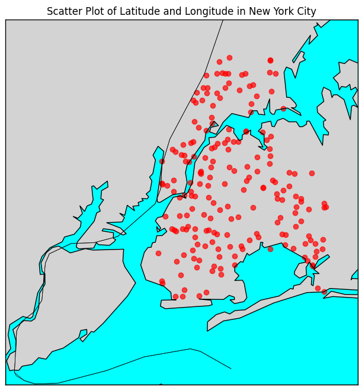

#### Demand Curve Stack Plot:
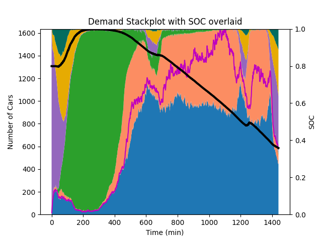

#### Drive to Charger Time vs. Available Chargers Plot:
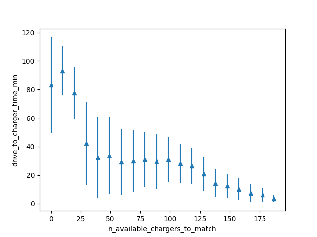

#### Pickup Time Histogram:
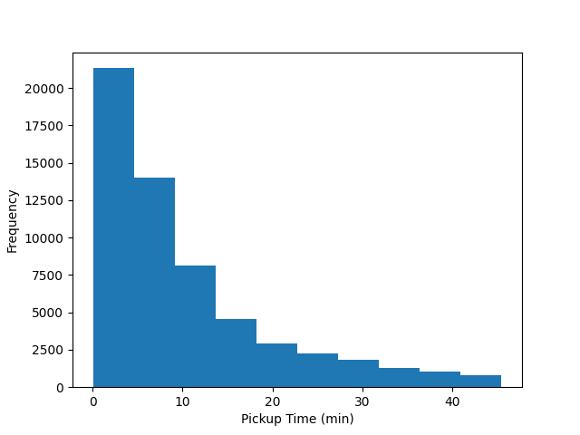

#### Pickup Time vs. Available Cars Plot:
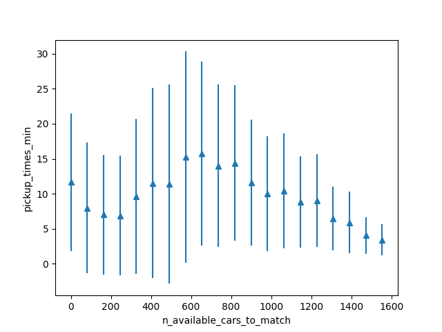

#### KPI:
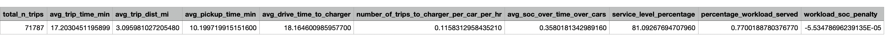


### Simulation Scenario 2
This section shows another example simulation running with the following parameters:
1. ```n_cars``` = Peak demand from dataset (equals to 2101)
2. ```n_chargers``` = ```int(n_cars * SimMetaData.consumption_kwhpmi * SimMetaData.avg_vel_mph / SimMetaData.charge_rate_kw)``` (equals to 270)
3. ```n_posts``` = 4
4. ```d``` = 5
5. ```charge_rate_kw``` = 20
6. ```dataset_source``` = New York taxi dataset
7. ```uniform_locations``` = ```False```
8. ```start_datetime``` = ```datetime(2024, 5, 1, 0, 0, 0)```
9. ```end_datetime``` = ```datetime(2024, 5, 4, 0, 0, 0)```
10. ```matching_algo``` = Power-of-d vehicles dispatch
11. ```charging_algo``` = Charge idle cars primarily at night
12. ```available_cars_for_matching``` = Vehicles that are idle, charging, and driving to charger
13. ```pickup_threshold_type``` = Constant threshold
14. ```adaptive_d``` = True
15. ```perc_trip_filter``` = 0.6
16. ```pickup_threshold_min``` = 45
17. ```infinite_chargers``` = False
18. ```dist_func``` = Manhattan distance
19. ```results_folder``` = ```"simulation_results"```
20. ```dataset_path``` = ```"yellow_tripdata_2024-05.parquet"```
21. ```ev_model``` = ```"Tesla_Model_3"```
22. ```avg_vel_mph``` = Comes from the dataset (equals to 11.208)
23. ```consumption_kwhpmi``` = Comes from the EV model (equals to 0.23)
24. ```pack_size_kwh``` = Calculated based on the EV model (equals to 51.75)
25. ```min_allowed_soc``` = 0.05
26. ```threshold_percent_of_cars_idling``` = 0.05
27. ```n_trips_before_updating_d``` = 1000
28. ```safety_factor_to_reach_closest_charger``` = 1.5
29. ```start_of_the_night``` = 23
30. ```end_of_the_night``` = 6
31. ```n_cars_driving_to_charger_discounter``` = 0.5
32. ```percentile_lat_lon``` = 99.9

Below are some results of the simulation.

#### Charger Locations Scatter Plot:
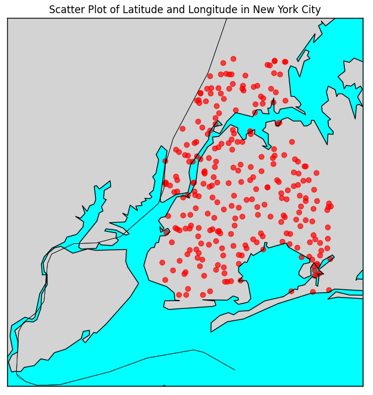

#### Demand Curve Stack Plot:
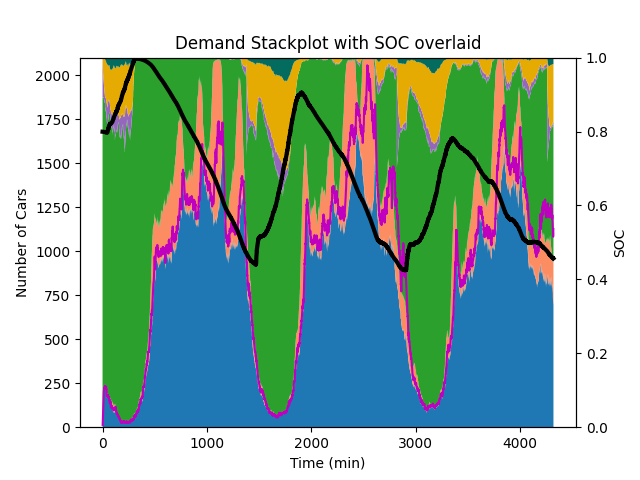

#### Drive to Charger Time vs. Available Chargers Plot:
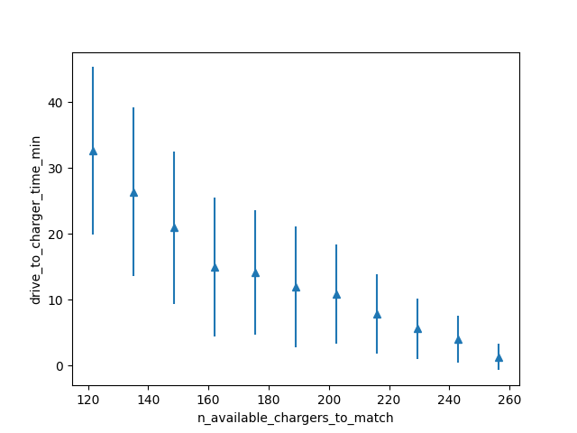

#### Pickup Time Histogram:
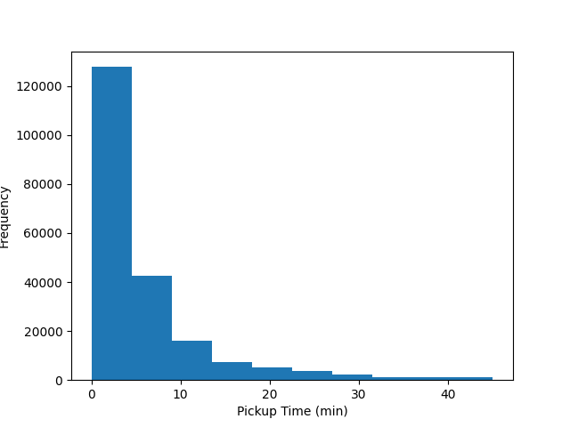

#### Pickup Time vs. Available Cars Plot:
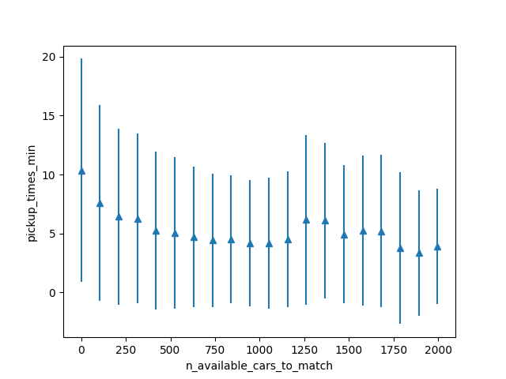

#### KPI:
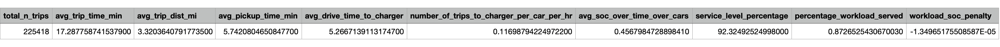


## Contact
### Sushil Varma
- School: INRIA Paris
- Email: sushil-mahavir.varma@inria.fr

### Chen Zhang
- School: Georgia Institute of Technology
- Email: chenzh708@gmail.com

